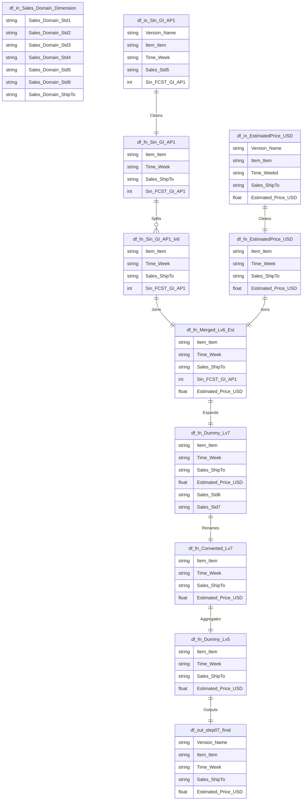
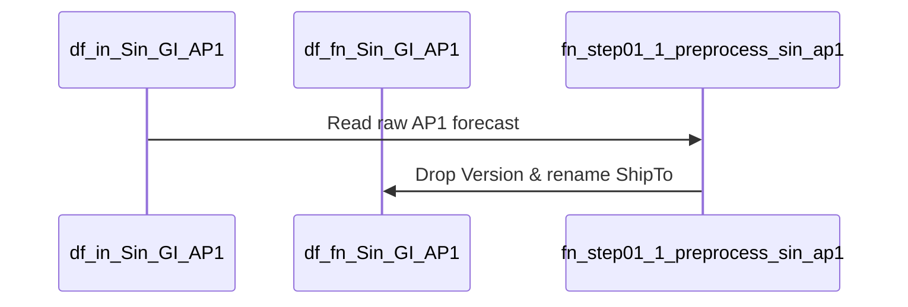
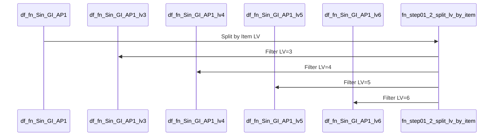
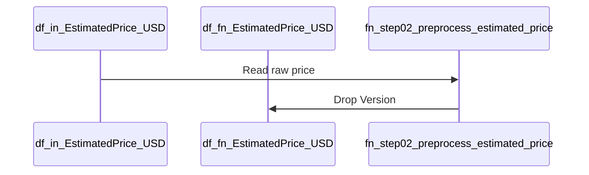
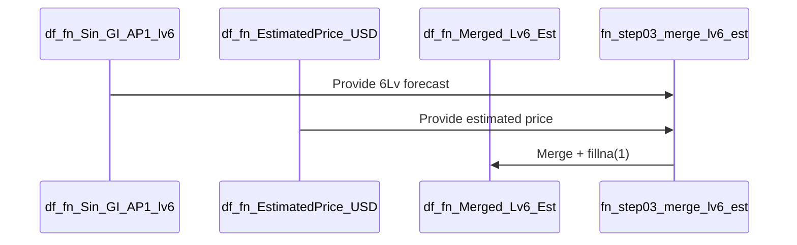
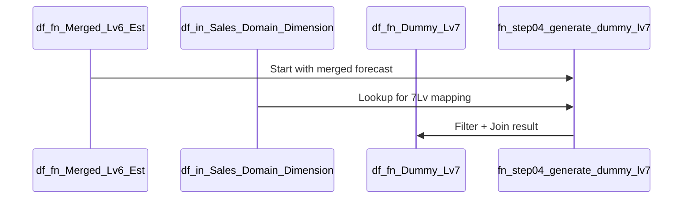
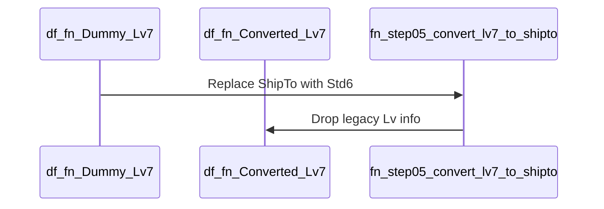
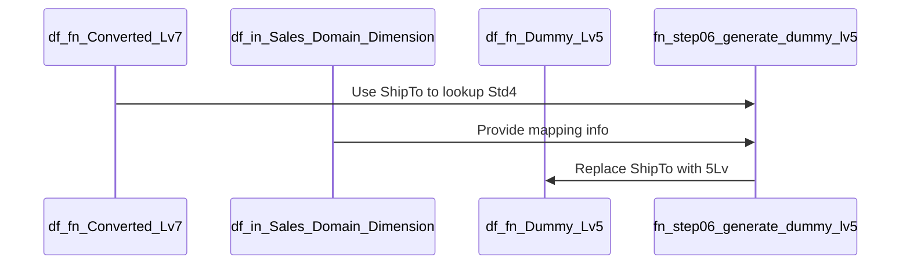
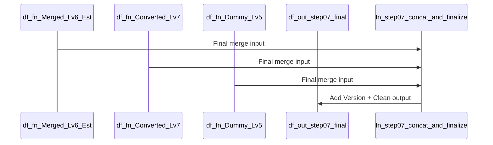

# ERD

# PYDPDummyPrice Sequence Diagrams (Function-by-Function)
## Step 01-1: fn_step01_1_preprocess_sin_ap1

## Step 01-2: fn_step01_2_split_lv_by_item.

## Step 02-1: fn_step02_preprocess_estimated_price.  Drop Version

## Step 03: fn_step03_merge_lv6_est

## Step 04: fn_step04_generate_dummy_lv7

## Step 05: fn_step05_convert_lv7_to_shipto

## Step 06: fn_step06_generate_dummy_lv5

## Step 07: fn_step07_concat_and_finalize

